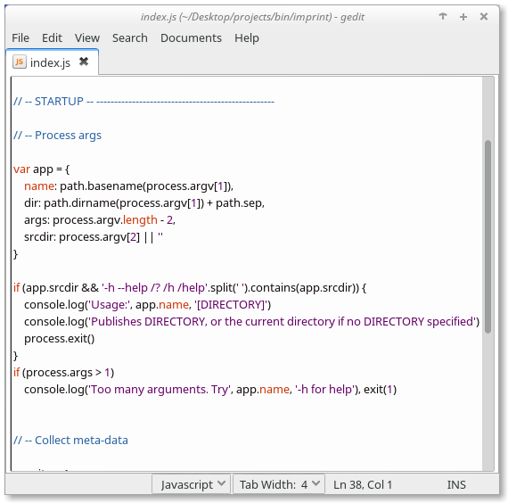
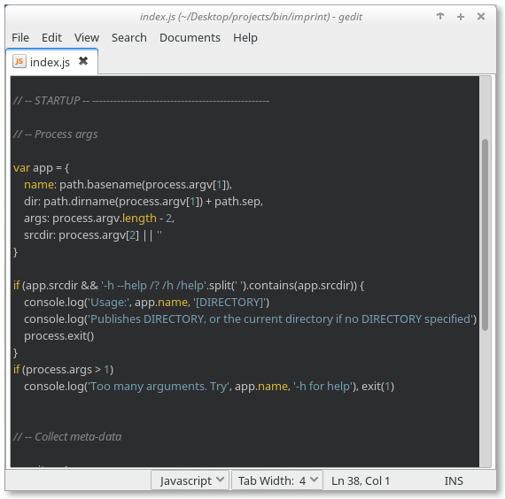

# Gedit Themes

No visual clutter for increased readability.

## Why?
Gedit default themes use too many colors for syntax highlighting. creating visual clutter and negatively affecting readability.

The two minimalistic themes in this package are designed to only use four primary color styles  for syntax highlighting, eliminating clutter and benefiting readability.

##### Light theme

##### Dark theme

The four primary colors differentiate general text, comments, keywords, and constants. Additional colors are used to highlight text selection, errors, notes (TODO, FIXME), and search results.

## Quick Start
Try the themes by adding them to gedit.

1. Download the xml theme files.
2. Select gedit's `Edit | Preferences` menu to open the dialog box.
3. Switch to the `Font & Colors` tab in the dialog box.
4. Press the `+` under `Color Scheme` and pick one of the downloaded theme files. The selected theme becomes the theme used by `gedit`.
5. Repeat for the other theme.

Enjoy!

## MIT License
See the LICENSE file for details. 

